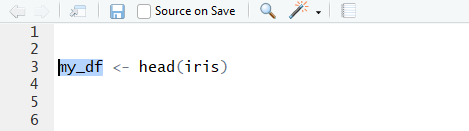
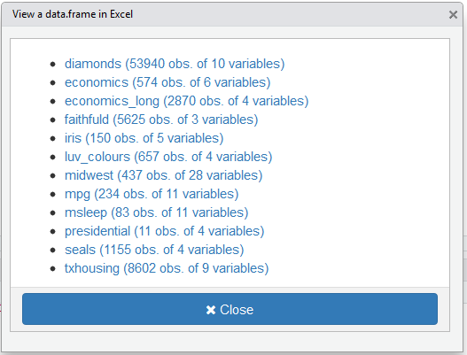

# viewxl

> An addin to view data.frame in Excel


[](https://travis-ci.org/dreamRs/viewxl)
[](http://www.repostatus.org/#active)


An addin to interactively export data.frame from global environment into Excel with [`writexl`](https://github.com/ropensci/writexl).

To try it, run : 

```r
source("https://install-github.me/dreamRs/viewinexcel")
```

Then launch the addin via the RStudio menu.

If you have selected a `data.frame` in your script, then this `data.frame`is open in Excel. Otherwise a window will appear :


* select a `data.frame` then launch the addin, The selected `data.frame` will be open in Excel directly :




* If no selection is made, a Shiny gadget is launched to select `data.frame` to open :




